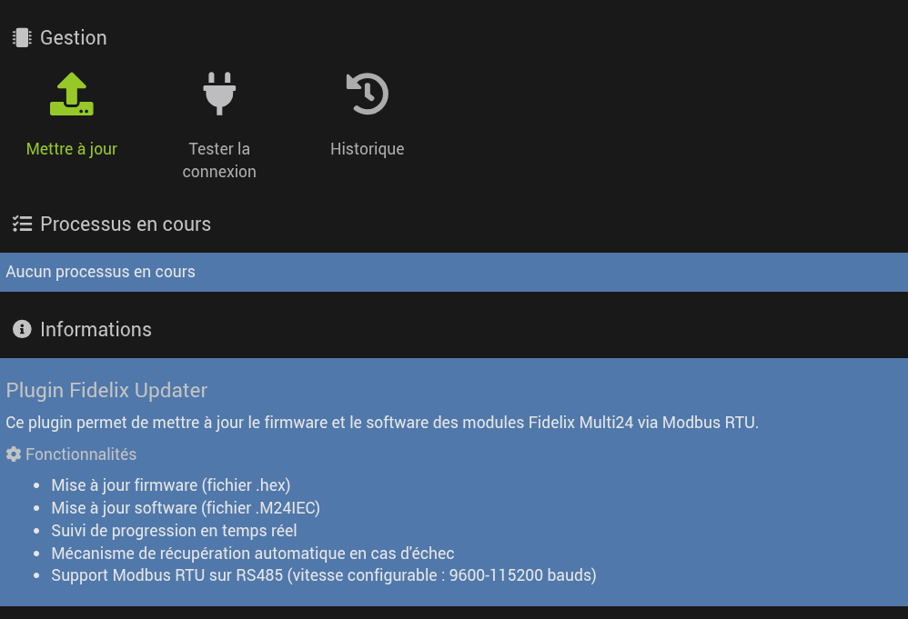
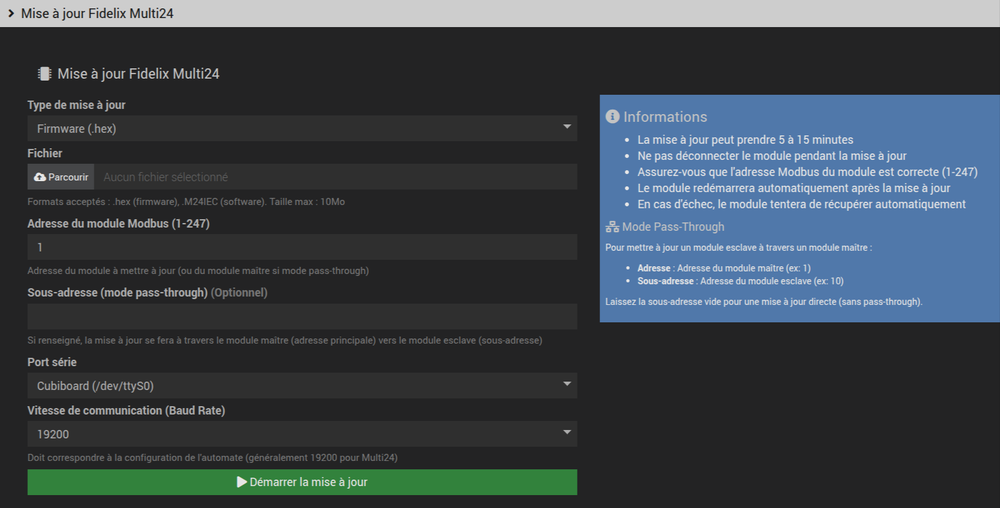
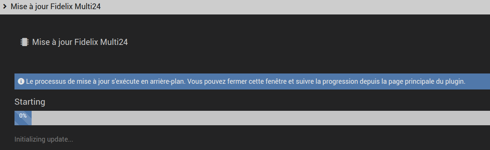
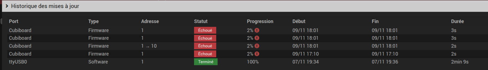
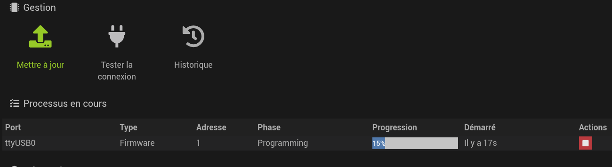
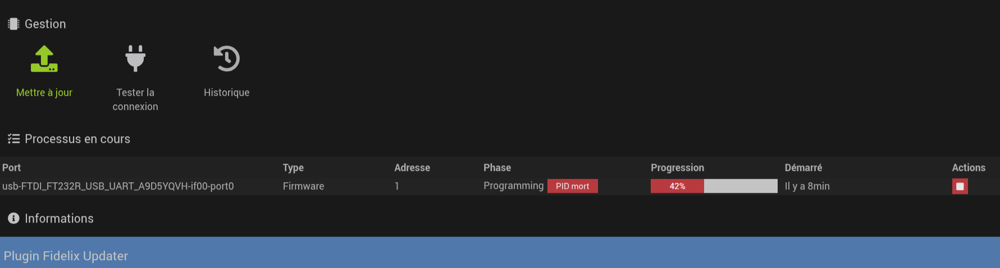

# Documentation Fidelix Updater

## Table des matières

- [Vue d'ensemble](#vue-densemble)
- [Prérequis et configuration initiale](#prérequis-et-configuration-initiale)
- [Utilisation détaillée](#utilisation-détaillée)
- [Architecture asynchrone](#architecture-asynchrone)
- [Communication Modbus](#communication-modbus)
- [Historique des mises à jour](#historique-des-mises-à-jour)
- [Gestion des processus](#gestion-des-processus)
- [Lock des ports série](#lock-des-ports-série)
- [Dépannage](#dépannage)

---

## Vue d'ensemble

Fidelix Updater est un plugin Jeedom permettant de mettre à jour le firmware et le software des automates **Fidelix Multi24** via le protocole Modbus RTU.

**Emplacement dans Jeedom :** Le plugin se trouve dans le menu **Plugins → Programmation → Fidelix Updater**

### Architecture générale

```
┌─────────────┐       RS485        ┌──────────────┐
│   Jeedom    │◄──────────────────►│ Multi24 #1   │
│  (Plugin)   │   Modbus RTU       │  (Maître)    │
└─────────────┘   57600 bauds      └──────────────┘
                                            │
                                            │ Modbus esclave
                                            ▼
                                    ┌──────────────┐
                                    │ Multi24 #2   │
                                    │  (Esclave)   │
                                    └──────────────┘
```

### Types de mise à jour

- **Firmware** (`.hex`) : Bootloader et système bas niveau
- **Software** (`.M24IEC`) : Application embarquée

---

## Prérequis et configuration initiale

Avant d'utiliser le plugin, certains prérequis système doivent être satisfaits :

### Prérequis logiciels

- **Node.js** version 12 ou supérieure
- Package Node.js `serialport` (installé automatiquement)
- **Port série** accessible (`/dev/ttyUSB*` ou `/dev/serial/by-id/...`)

### Permissions système

L'utilisateur `www-data` doit avoir accès au port série via le groupe `dialout`.

### Diagnostic système

Lors de la première utilisation, accédez à la page de configuration du plugin pour vérifier l'état des prérequis :

**Chemin :** `Plugins → Programmation → Fidelix Updater → Configuration`

Le diagnostic vérifie automatiquement :
- Node.js (version 12+)
- Groupe dialout (permissions port série)
- Dépendances npm (serialport, etc.)
- Ports série disponibles

### Correction automatique des permissions

Si le diagnostic affiche des erreurs ou des avertissements, utilisez le bouton **"Reconfigurer les permissions"** disponible sur la page de configuration.

Ce bouton corrige automatiquement :
- Ajout de `www-data` au groupe `dialout`
- Installation des dépendances npm manquantes
- Permissions des ports série
- Permissions des dossiers du plugin

**Utilisation :** Cliquez sur le bouton, attendez 10-30 secondes, puis rechargez la page pour vérifier que tous les voyants sont au vert.

### Test de fonctionnement

Une fois les prérequis satisfaits, vous pouvez tester le plugin :

1. Accédez à la page principale du plugin : **Plugins → Programmation → Fidelix Updater**
2. Cliquez sur le bouton **"Tester la communication"**
3. Le plugin vérifiera :
   - La disponibilité du port série
   - La communication Modbus avec le module
   - Les permissions d'accès

Si le test réussit, le plugin est prêt à effectuer des mises à jour. En cas d'échec, consultez la section [Dépannage](#dépannage) pour résoudre les problèmes.

---

## Utilisation détaillée

### Accès au plugin

1. Depuis le menu Jeedom : **Plugins → Programming → Fidelix Updater**
2. Cliquer sur le bouton **"Mettre à jour Firmware/Software"**



### Configuration d'une mise à jour

#### 1. Sélection du type de mise à jour

Choisir entre :
- **Firmware** : Accepte uniquement les fichiers `.hex`
- **Software** : Accepte uniquement les fichiers `.M24IEC`



#### 2. Upload du fichier

- Taille maximale : **10 Mo**
- Le fichier est uploadé dans `data/filetransfer/`
- Validation automatique de l'extension

#### 3. Configuration des paramètres

**Adresse Modbus :**
- Valeur entre **1** et **247**
- Correspond à l'adresse du module cible
- Pour une mise à jour directe : laisser "Sous-adresse" vide

**Sous-adresse (optionnel) :**
- Pour le mode **pass-through** uniquement
- Permet d'atteindre un module esclave via un maître
- Exemple : Adresse=1, Sous-adresse=10 → mise à jour du module esclave #10 via le maître #1

**Port série :**
- Sélection dans la liste des ports disponibles
- Préférer `/dev/serial/by-id/...` pour éviter les changements au redémarrage
- Le port doit être accessible (permissions dialout)

#### 4. Lancement de la mise à jour

Cliquer sur **"Démarrer la mise à jour"**

Le plugin :
1. Génère un ID unique pour cette mise à jour
2. Crée un fichier de statut `status_{updateId}.json`
3. Lance le processus Node.js en arrière-plan
4. Retourne immédiatement (mode asynchrone)
5. Démarre le polling automatique de progression

---

## Architecture asynchrone

### Pourquoi l'asynchrone ?

Les mises à jour peuvent durer **5 à 15 minutes** pour le firmware, et **3 à 8 minutes** pour le software. Un processus synchrone causerait :
- ⚠️ Timeout HTTP (serveur web)
- ⚠️ Interface bloquée
- ⚠️ Impossibilité d'annuler
- ⚠️ Aucun feedback en temps réel

### Fonctionnement du mode asynchrone

```
┌─────────────┐                           ┌──────────────┐
│   Browser   │ 1. startUpdate (AJAX)    │  PHP Handler │
│             │─────────────────────────►│              │
└─────────────┘                           └──────────────┘
      │                                          │
      │                                          │ 2. Create status file
      │                                          │    Generate updateId
      │                                          │    Launch Node.js &
      │                                          │    Return immediately
      │                                          ▼
      │ 3. Returns {updateId, statusFile}  ┌──────────────┐
      │◄────────────────────────────────── │              │
      │                                     │  Background  │
      │ 4. Start polling (every 2s)        │   Node.js    │
      │                                     └──────────────┘
      │                                          │
      │                                          │ Writes progress
      │                                          │ every update
      │                                          ▼
      │ 5. getStatus (polling)             ┌──────────────┐
      │◄─────────────────────────────────┐ │ status.json  │
      │  Returns {phase, progress, error} │ │  {          │
      │                                    │ │   phase,    │
      │ 6. Update UI                       │ │   progress, │
      │    Display real progress           │ │   error     │
      │                                    │ │  }          │
      │    Stop when progress=100          │ └──────────────┘
      │    or error != null                │
      └────────────────────────────────────┘
```

### Fichier de statut

Format JSON du fichier `data/status/status_{updateId}.json` :

```json
{
  "phase": "Programming",
  "status": "Programming device... packet 45/128",
  "progress": 35,
  "timestamp": "2025-11-09T18:30:15+00:00",
  "error": null
}
```

**Phases possibles :**
- `"Starting"` : Initialisation
- `"Connecting"` : Connexion au module
- `"Preparing"` : Préparation de la mise à jour
- `"Programming"` : Programmation en cours
- `"Verifying"` : Vérification
- `"Completed"` : Terminé avec succès
- `"ERROR"` : Erreur (avec `error` != null)

### Polling JavaScript

**Fréquence :** Toutes les **2 secondes**

**Arrêt automatique :**
- Quand `progress >= 100`
- Quand `error != null`
- Après timeout (30 minutes max)

**Cleanup :**
- Suppression automatique du fichier de statut
- Suppression du script Node.js temporaire
- Exécuté après succès ou erreur



---

## Communication Modbus

### Timeouts et retries

**Timeouts :**
- Timeout standard : **3000 ms** (3 secondes)
- Timeout pattern : **3000 ms**

**Retries :**
- Nombre de tentatives : **10**
- Délai entre tentatives critiques : **500 ms**

Ces valeurs ont été optimisées pour assurer une fiabilité maximale des mises à jour.

---

## Historique des mises à jour

Le plugin conserve un **historique JSON** de toutes les mises à jour effectuées.

### Fichier d'historique

**Emplacement :** `data/update_history.json`

**Format :**
```json
[
  {
    "id": "update_6730a1b2c4567",
    "timestamp": "2025-11-09T18:45:32+00:00",
    "type": "m24firmware",
    "filename": "Multi24-v2.81.hex",
    "address": 1,
    "subaddress": null,
    "port": "/dev/serial/by-id/usb-FTDI_FT232R_USB_UART_A9D5YQVH-if00-port0",
    "status": "success",
    "duration": 847,
    "error": null
  },
  {
    "id": "update_6730a3f1d8912",
    "timestamp": "2025-11-09T19:12:15+00:00",
    "type": "m24software",
    "filename": "Program_v1.5.M24IEC",
    "address": 1,
    "subaddress": 10,
    "port": "/dev/serial/by-id/usb-FTDI_FT232R_USB_UART_A9D5YQVH-if00-port0",
    "status": "error",
    "duration": 124,
    "error": "Timeout waiting for device response"
  }
]
```

### Affichage de l'historique

L'historique est affiché sur la page principale du plugin avec :
- ✅ Icône de succès/erreur
- 📅 Date et heure
- 📦 Type de mise à jour
- 📄 Nom du fichier
- 🎯 Adresse(s) cible(s)
- ⏱️ Durée
- ❌ Message d'erreur si échec



### Stratégie de rétention et nettoyage automatique

Un **cron horaire** (`cronHourly()`) effectue automatiquement les opérations suivantes :

**1. Synchronisation des processus actifs**
- Lecture des fichiers de statut pour mettre à jour le registry
- Détection automatique des processus terminés (succès ou erreur)
- Détection des crashs silencieux (processus morts depuis >30s)
- Libération des ports série bloqués

**2. Nettoyage de l'historique**
- Processus terminés depuis **plus de 7 jours** : supprimés
- Si reste > **50 entrées** : conservation des 50 plus récentes uniquement
- Processus en cours (`running`) : **jamais supprimés**

**3. Nettoyage des fichiers temporaires**

| Type de fichier | Rétention | Suppression |
|----------------|-----------|-------------|
| Status files (`.json`) | 0 jour | Dès que processus terminé |
| Scripts Node.js (`.js`) | 0 jour | Dès que processus terminé |
| Logs stderr (`.log`) | 7 jours | 7 jours après fin du processus |
| Fichiers uploadés (`.hex`, `.M24IEC`) | 0 jour | Dès que processus terminé |

**Pourquoi cron horaire ?**
- Détection rapide des fins de processus (<1h)
- Libération rapide des ports série bloqués
- Détection des crashs silencieux
- Équilibre entre réactivité et charge système

---

## Gestion des processus

### Liste des processus actifs

Le plugin affiche en temps réel tous les **processus de mise à jour en cours**.

**Informations affichées :**
- ID du processus
- Type (firmware/software)
- Adresse cible
- Progression (%)
- Durée écoulée
- Phase actuelle



### Fichier de suivi des processus

**Emplacement :** `data/processes.json`

**Format :**
```json
{
  "update_6730a1b2c4567": {
    "pid": 12345,
    "startTime": "2025-11-09T18:45:32+00:00",
    "type": "m24firmware",
    "address": 1,
    "subaddress": null,
    "port": "/dev/serial/by-id/usb-FTDI_FT232R_USB_UART_A9D5YQVH-if00-port0",
    "statusFile": "status_6730a1b2c4567.json",
    "phase": "Programming",
    "progress": 35
  }
}
```

### Kill d'un processus

**Quand utiliser :**
- ⚠️ Mise à jour bloquée
- ⚠️ Erreur persistante
- ⚠️ Besoin d'annuler la mise à jour

**Fonctionnement :**

1. Cliquer sur le bouton **"Tuer le processus"** dans la liste des processus actifs
2. Le plugin exécute un **SIGTERM** (arrêt propre)
3. Si le processus ne s'arrête pas après 5 secondes : **SIGKILL** (arrêt forcé)
4. Suppression du fichier de statut
5. Suppression du script temporaire
6. Retrait de la liste des processus actifs

**⚠️ Attention :**
- Le module peut rester en **mode programmation** après un kill
- Il faut alors utiliser le **mécanisme de récupération** (redémarrage du module)



---

## Lock des ports série

### Pourquoi un système de lock ?

Un port série **ne peut être utilisé que par un seul processus à la fois**. Sans système de lock :
- ❌ Deux mises à jour simultanées sur le même port → conflit
- ❌ Corruption des données
- ❌ Blocage des processus

### Mécanisme de lock

**Fichier de lock :** `data/locks/port_{port_hash}.lock`

**Format :**
```json
{
  "port": "/dev/serial/by-id/usb-FTDI_FT232R_USB_UART_A9D5YQVH-if00-port0",
  "updateId": "update_6730a1b2c4567",
  "lockedAt": "2025-11-09T18:45:32+00:00",
  "pid": 12345
}
```

### Workflow de lock

**Avant de démarrer une mise à jour :**

1. Calcul du hash du port série
2. Vérification de l'existence du fichier de lock
3. Si lock existe :
   - Vérifier si le PID est toujours actif
   - Si PID mort → supprimer le lock (lock orphelin)
   - Si PID actif → **refuser la mise à jour**
4. Si pas de lock → créer le lock et continuer

**Après la mise à jour :**

1. Suppression automatique du fichier de lock
2. Libération du port pour d'autres processus

### Gestion des locks orphelins

Un **lock orphelin** se produit si :
- Le processus a crashé
- Le serveur a redémarré
- Un kill brutal a été effectué

**Détection automatique :** Le plugin vérifie si le PID associé au lock est toujours actif. Si le PID n'existe plus, le lock orphelin est automatiquement supprimé.

---

## Dépannage

### Le diagnostic affiche des erreurs

**Solution :** Utiliser le bouton **"Reconfigurer les permissions"** sur la page de configuration.

Ce bouton corrige automatiquement :
- Permissions du groupe dialout
- Installation des dépendances npm
- Permissions des ports série
- Permissions des dossiers du plugin

### Erreur "Port série déjà utilisé"

**Cause :** Un lock existe sur le port

**Solution :**
1. Vérifier la liste des processus actifs
2. Si pas de processus actif → lock orphelin
3. Forcer la suppression du lock depuis la page de configuration
4. Relancer la mise à jour

### La mise à jour reste bloquée à X%

**Solutions :**

1. **Attendre** : Certaines phases peuvent prendre plusieurs minutes
2. **Vérifier les logs Node.js** :
   ```bash
   tail -f /var/www/html/plugins/fidelixUpdater/3rdparty/Fidelix/FxLib/logsJeedom.txt
   ```
3. **Si vraiment bloqué** : Utiliser le bouton "Tuer le processus"
4. **Redémarrer le module** (couper/rallumer l'alimentation)
5. **Relancer la mise à jour**

### Le module ne répond plus après une mise à jour

**Cause :** Le module est resté en mode programmation

**Solution :**

1. Couper l'alimentation du module
2. Attendre 10 secondes
3. Rallumer le module
4. Le mécanisme de récupération intégré devrait restaurer le module
5. Si toujours bloqué : Relancer la mise à jour complète

### Logs à consulter

**Logs Jeedom :**
```bash
tail -f /var/www/html/log/fidelixUpdater
```

**Logs Node.js :**
```bash
tail -f /var/www/html/plugins/fidelixUpdater/3rdparty/Fidelix/FxLib/logsJeedom.txt
```

**Logs système (permissions) :**
```bash
tail -f /var/log/apache2/error.log
```

---

## Support technique

Pour toute question ou problème :

**Email :** nicolas@codemate.consulting
**GitHub :** [Issues](https://github.com/nicolas-codemate/jeedom-fidelixUpdater/issues)
